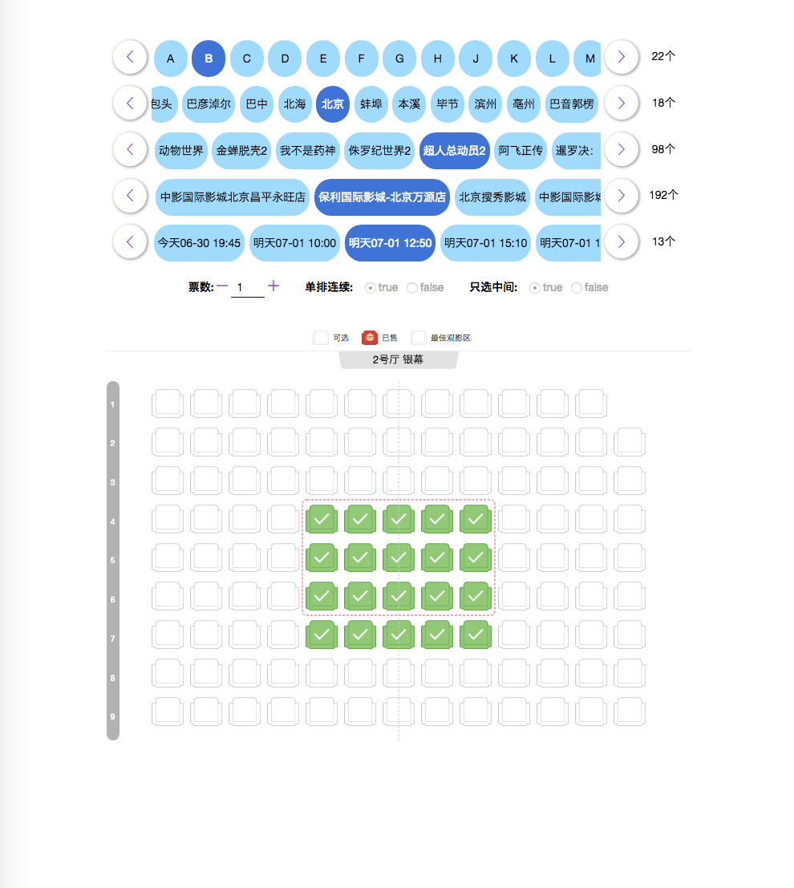
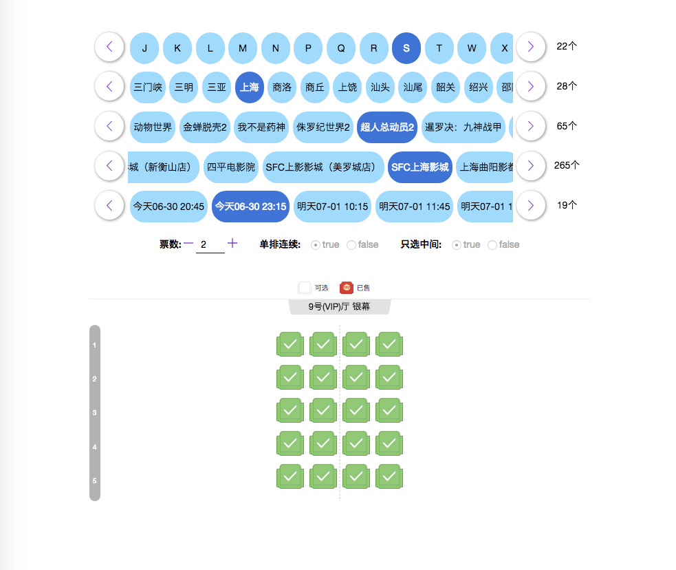
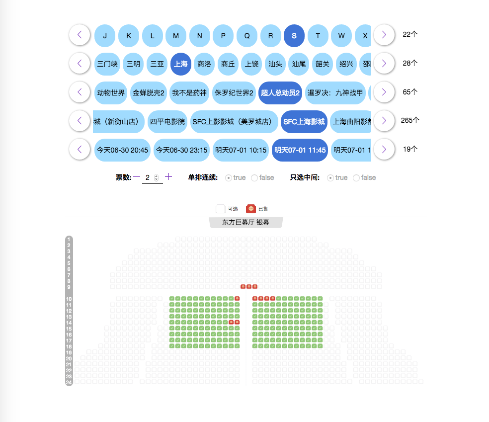
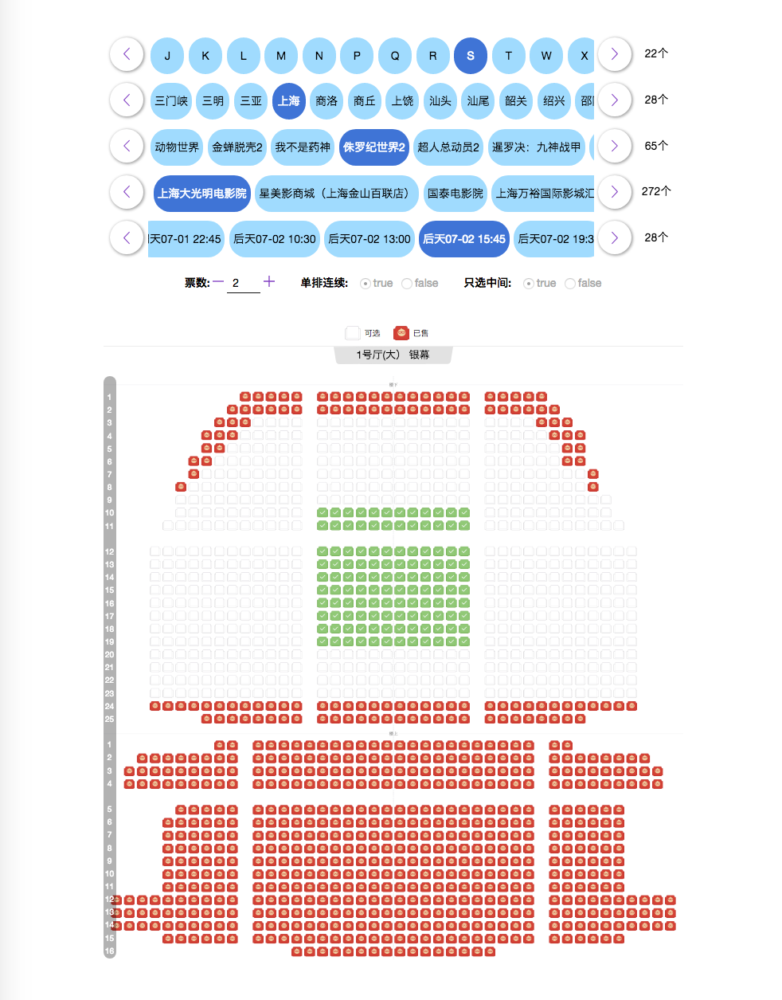
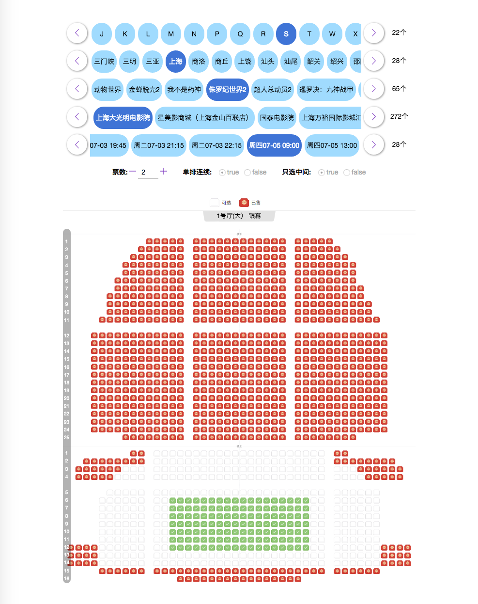
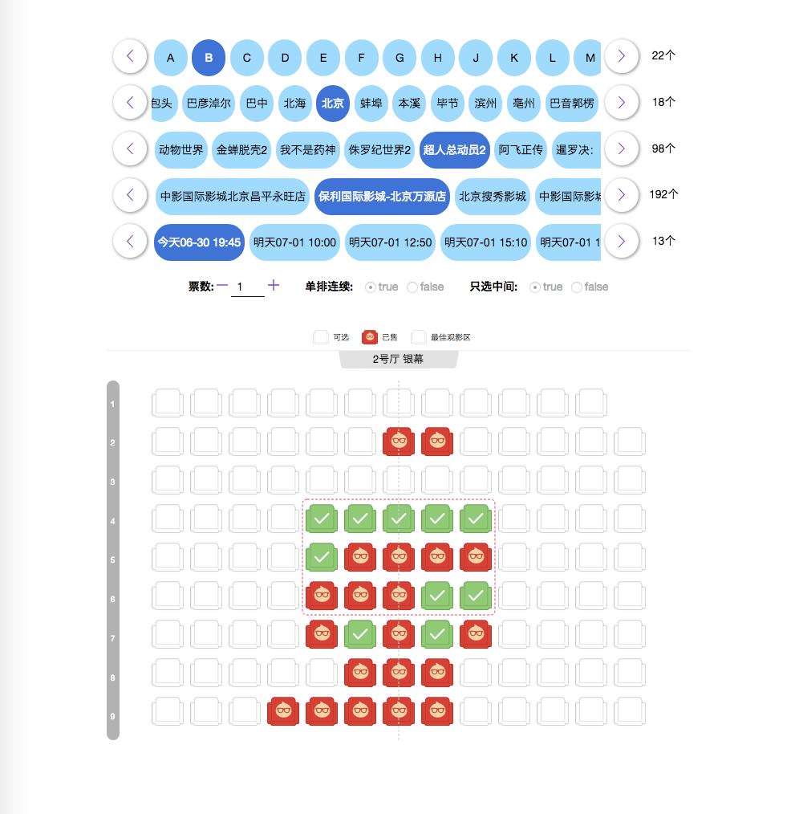
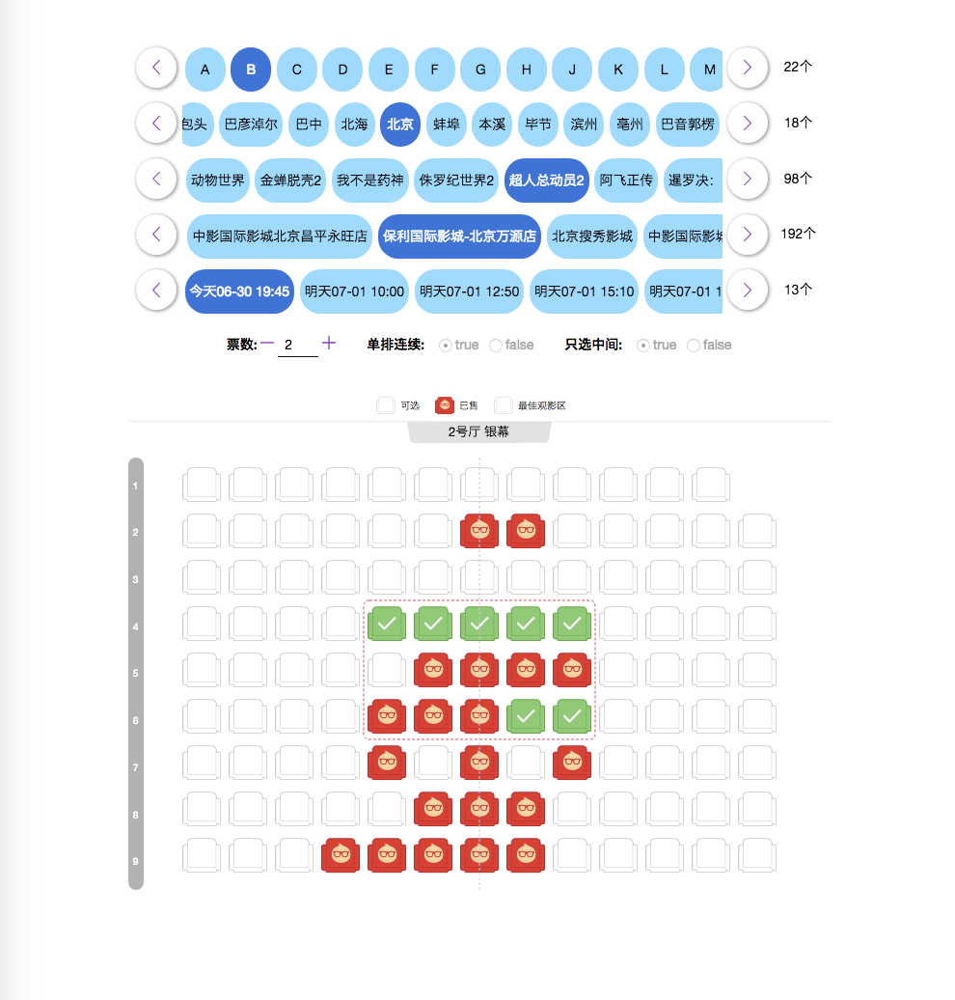
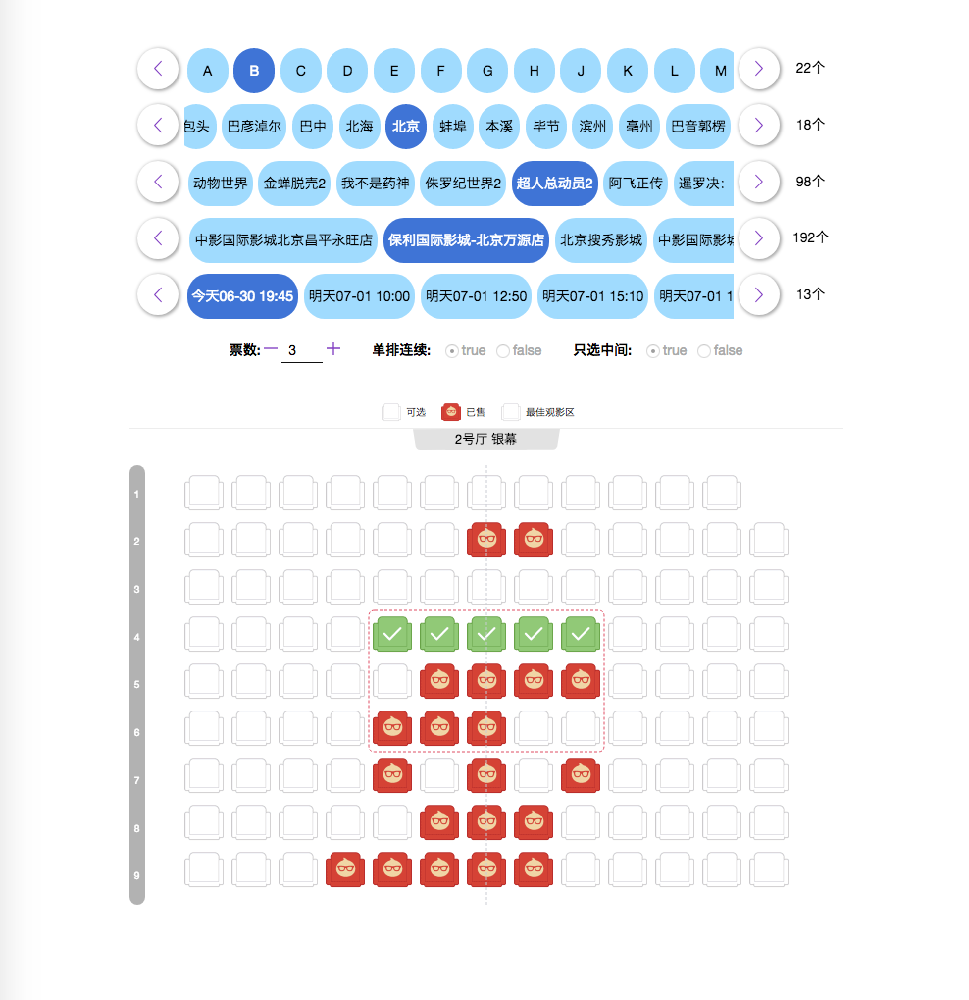
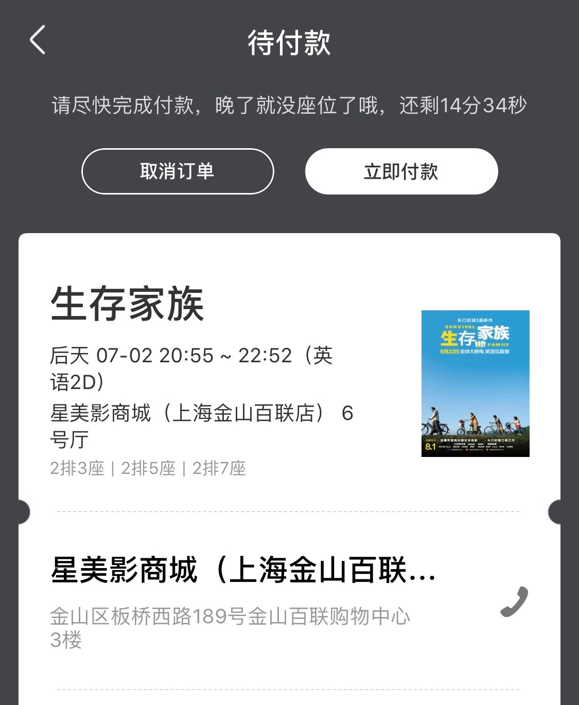

### 使用脚本的好处

1.  脚本能迅速筛选出所有符合条件的全场最佳座位，
2.  能几乎同时对所有“全场最佳”发起锁定请求，无论哪一个请求成功，都是达到目的。

### 选座演示

#### 估计最佳区域



#### VIP 厅



#### 一般厅



#### 多个厅楼下



#### 多个厅楼上



#### 只需要一个座



#### 需要两个座



#### 需要三个座



### 备注

对于"XXOOOXOXOOXO"(X 表示不可预定，O 表示可以预定)，在需要 2 个座位的前提下，有三种选择。

### 关于选座(cosy zone)

会优先选择靠中间的排，再在每排选择靠中间连续的座位。

### 对“全场最佳”的解释

中心及中心靠后。

### 注意事项

1.  ～～淘票票目前普遍是单次最多选 4 个座位，脚本会优先锁定 4 个连在一起的座位（默认配置），大于 4 个的需求无法保证所有座位是连续的。～～

### 待处理

1.  ~~limit 是否是 4 有待验证~~ 答案是: 通过 API 提交，可以绕过前端单个订单最多 4 票的限制。单个订单最多票数不超过 10。
2.  ~~直接通过 API 提交可绕过“不要留下单个空座”的限制~~
3.  ~~绕过"请选择连在一起的座位，不要留下单个空座"的限制~~  
4.  ~~处理包括特价票在内的活动相关的下单问题~~

```js
{
    returnCode: '55047',
    returnMessage: '影院调整了价格，请刷新重试,购买价格:[12980],影院价格:[13200]'
}
```

5.  防刷验证

```js
{
  ret: [
    'FAIL_SYS_USER_VALIDATE',
    'RGV587_ERROR::SM::哎哟喂,被挤爆啦,请稍后重试'
  ],
  data: {
    url:
      'https://acs.m.taopiaopiao.com:443//h5/mtop.film.mtopscheduleapi.getcinemaschedules/7.0/_____tmd_____/punish?x5secdata=5e0c8e1365474455070961b803bd560607b52cabf5960afff39b64ce58073f7822e7021ae301d9391bb634a1294aec69e9d67954193570e84eaec4f9d95d69b1d5b117f96c52a60108ed1b3f88e87cd8bce551cd3d7677c46af887fc3ab77968ae05d6a084e26e17fce6f28abaf9fc956e0024606f075187de98b2e34e8bf427f01c1f73bbe24d0a2be3b240887756f4ef719506e3671dadcecdd783f3b3262403f5cf46c74aa02d9152649a62cf6adcb5a28f8b0f44cc91b158535a3028424dd254f8f58fb4f5c58501567b6b91acb6dbd13fac7c085e1ae9b5fecf823bb944c9222b737bfc078b4d0f6af7f106805d77bf364627b8d59d4de5cbf45b17c061b680b45c2a37d8da44fa777cf195dcd5e52b8ed3c62c33fa95599731b6542c24afb365816e72be7fdd10a302a21035c93f149015ba772327dae24a7c1acc8e7568da8ad4cf2da241771632b091145477893f290e5c6558976b6a74df89bf1a5bac62b8c07ac9734d6799e4f8b11e11a59dab80f89293688707c3aec5d53b80edd494d120ba9fe183d4e42363eba46542a938d88373c7d2850b6bd6be5d7eecc85f018000bf3e3df268f4af71987b4bd691e583e15c08693c292b85598eb2f5254deb59497f3e1fd07b5042acc2ea911037accc8ca9370a5b044570cb98b4e849cfb2fa33f44ffff18ad44140bfa3e74b344f71553b92aab3880a12f3895e6532479f9c0e05968709c514ad5fe660ee97c28ba5e7890ee03ec149697d73f46de45a2be4ab488ef16f5481f3a9bd2707c2902b036cbc1d749491790024a1382ea637a0d5c99e0bd381eeefb6c8cb07234fb7dc123235f3117cfb2b8dca49916bcff7261dd32cafa8a344ecc210c7a88ea7617120959bd86b24d99839c0d3ce69f1de7ab344399f5a28a55c94d9e8d54876792497083c4ae1253deb2650e0a8f479de179d0cb44c0df6e0b0005c65192bb2e5728f6573aadbfe5140b8366edb0afd9208faeb8aaa350bf45f1f90faeddd54fe10da7e371d0b2f5d45fc74eb1d5930b72f5a9646f2afcb7cee0e7efc5e0a9bb93214c80375de0a6d0fc33906b7f704280d5989b4e5a31ecfed002691135cfb9b75d118f28a7bea3fb5c554766d6083ed455e2acb64399f56001581e9bd4e6246d7c07b418bd61930fcc7f43085f215602ff14c1eeffa993259bf8351d819eb3f4129c5e95a897ae925e3fabb3e1a8c52f69e50d92719202dbc208a99675c9b&x5step=2'
  }
}
```

6.  不要前两排和后两排，不要每排两端的一个位置。
